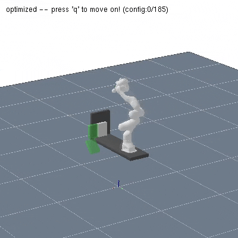
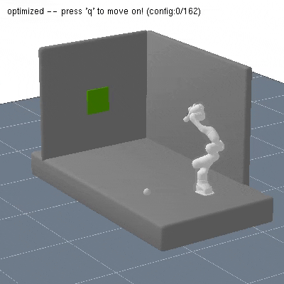

This repository aims to rerun the code that was used for [Prof. Marc Toussaint](https://www.user.tu-berlin.de/mtoussai/)'s papers ["20-IROS: Describing Physics For Physical Reasoning: Force-based Sequential Manipulation Planning"](https://arxiv.org/abs/2002.12780) and ["21-ICRA: Co-Optimizing Robot, Environment, and Tool Design via Joint Manipulation Planning"](https://ieeexplore.ieee.org/document/9561256). The original repos can be found at [20-IROS-ForceBased](https://github.com/MarcToussaint/20-IROS-ForceBased) and [21-ICRA-DesignOpt](https://github.com/MarcToussaint/21-ICRA-DesignOpt). 

# Quick Start

```
mkdir -p $HOME/git
cd $HOME/git
git clone https://github.com/yuezhezhang/21-ICRA-DesignOpt.git
cd 21-ICRA-DesignOpt

git submodule init
git submodule update

make -j1 installUbuntuAll  # calls sudo apt-get install; you can always interrupt
cd demo_IROS
make -j4
./x.exe

cd ../demo_ICRA
make -j4
./x.exe -seed 1 -mode 0 -numCases 3 -scenario wrenchTool
./x.exe -seed 1 -mode 0 -numCases 3 -scenario resorting
```

# Demos

## Save the Videos
You can specify the saved video path in:

```
while(V.playVideo(C.frames.N, true, 10, "video/filename"));
```

and comment this line in the `viewer.cpp`:
```
rai::system(STRING("rm -f " <<saveVideoPath <<"*.ppm"));
```

To transform the saved ppms into an mp4, run in terminal:
```
cd video
ffmpeg -framerate 20 -i filename%04d.ppm -c:v libx264 -crf 25 -vf "scale=400:400,format=yuv420p" -movflags +faststart IROS_1.mp4
```

To transform the mp4 into a high-quality gif, run:
```
ffmpeg -i IROS_1.mp4 IROS_1%04d.png
gifski -o IROS_1.gif IROS_1*.png
```

## 20-IROS

| Stable Grasp | Book on Shelf |
|---|---|
 |  |

| Billards | Lift Ring |
|---|---|
 |  |

| Force Grasp | Push with Stick |
|---|---|
 |  |

## 21-ICRA

| Resorting | Wrench Tool |
|---|---|
 |  |